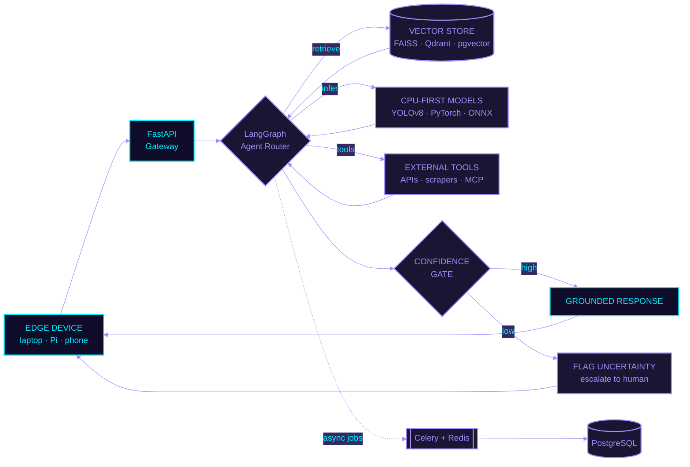

## `◤ 01 ◢` BOOT.SEQUENCE

```console
$ ./initialize --operator johnson_christopher_hassan

[ OK ] mounting identity ......................... johnson_christopher_hassan
[ OK ] role ..................................... Software & AI Engineer @ BLECA SmartLabs
[ OK ] role ..................................... Software & AI Engineering Intern @ Neurotech Africa
[ OK ] founder .................................. Technical Founder @ Next Gen Lab
[ OK ] education ................................ Computer Engineering @ MUST, Tanzania
[ OK ] location ................................. Mbeya, Tanzania [-8.9094, 33.4608]
[ OK ] loading mission .......................... ai_infrastructure_should_work_where_its_needed_most()
[ OK ] runtime .................................. CPU-first :: offline-first :: edge-native

> system online. awaiting instructions_
```

<br/>

## `◤ 02 ◢` HOLO.ID

<div align="center">

<table>
<tr>
<td width="45%" align="center">


`OPERATOR // 96×96 RENDER`

</td>
<td width="55%" align="left">

```yaml
operator:   Johnson Christopher Hassan
callsign:   johnson2006christopher
class:      Software & AI Engineer
subclass:   Agentic Systems / Edge AI
base:       Mbeya, Tanzania
org:        BLECA SmartLabs
            Neurotech Africa
            Next Gen Lab [founder]
focus:      - CPU-first computer vision
            - offline-first inference
            - autonomous agent pipelines
            - grounded RAG systems
status:     ONLINE // open to collaboration
```

<div align="center">

[](https://johnsoncv.netlify.app/)
[](https://johnsonchristopher.substack.com/)
[](https://www.linkedin.com/in/johnson-hassan-935124311/)
[](mailto:johnson2006christopher@gmail.com)

</div>

</td>
</tr>
</table>


</div>

<br/>

## `◤ 03 ◢` SKILL.MATRIX

<div align="center">

**`// CORE LANGUAGES`**


**`// AI · MACHINE LEARNING · VISION`**


**`// LLM · AGENTIC SYSTEMS`**


**`// VECTOR · RETRIEVAL`**


**`// BACKEND · DISTRIBUTED SYSTEMS`**


**`// DATA LAYER`**


**`// FRONTEND`**


**`// DEVOPS · CLOUD · EDGE`**


**`// FOUNDATIONS`**


</div>

<br/>

## `◤ 04 ◢` SYSTEM.ARCHITECTURE

> How a request actually moves through the systems I build.



> The confidence gate is the part most pipelines skip. A model that says *"I don't know"*
> is worth more in a rural clinic or classroom than one that guesses confidently and wrong.

<br/>

## `◤ 05 ◢` DEPLOYED.SYSTEMS

<table>
<tr>
<td width="100%">

### `[ LIVE ]` 🌿 [AdaptShot](https://github.com/johnson2006christopher/adaptshot)

**`CPU-FIRST FEW-SHOT COMPUTER VISION ENGINE`**

[](https://pypi.org/project/adaptshot/)
[](https://pypi.org/project/adaptshot/)
[](https://github.com/johnson2006christopher/adaptshot)

Offline, GPU-free few-shot vision built for edge deployment — laptops, Raspberry Pi, anywhere the cloud isn't. Runs under **250MB RAM**, adapts from fewer than 50 human corrections per class, and flags uncertainty instead of guessing wrong.

```bash
> pip install adaptshot
```

</td>
</tr>
<tr>
<td width="100%">

### `[ LIVE ]` 🛡️ [Legal Guard AI — Tanzania Edition](https://github.com/johnson2006christopher/legal_guard_ai)

**`EMPATHETIC AI LEGAL ADVISOR // BROWSER EXTENSION`**

Side-panel assistant that decodes Tanzanian contracts, ToS documents, and statutes into plain, Swahili-friendly English. Dual-engine design: a Contract Auditor (0–100 risk scoring, red-flag detection) and a Conversational Assistant covering BRELA, TRA, OSHA, and COSOTA procedures — grounded via a lightweight RAG pipeline (ChromaDB + FastAPI) over the Companies Act and Labour Act to keep hallucination near zero.

</td>
</tr>
</table>

<br/>

## `◤ 06 ◢` CLASSIFIED.SYSTEMS

<div align="center">

| STATUS | PROJECT | ROLE | ARCHITECTURE |
| :---: | :---: | :---: | :--- |
| `🔒 PRIVATE` | **ExamGuard AI** | Creator & Lead Engineer | Edge-powered exam proctoring — local YOLOv8 inference cuts bandwidth 98% (< 15MB/hr) |
| `🔒 PRIVATE` | **Mail Room** | Backend Architect | Async email broadcasting engine — FastAPI · Celery · Redis |
| `🔒 PRIVATE` | **AgroScan+** | ML Engineer | Maize leaf disease detection, > 90% validation accuracy — PyTorch · TensorFlow · FastAPI |

</div>

<br/>

## `◤ 07 ◢` NEXT.GEN.LAB // CONSULTING

<div align="center">

| SERVICE | DELIVERABLE |
| :--- | :--- |
| 🤖 Autonomous AI Agents | Custom LangGraph pipelines wired through FastAPI |
| 📄 Private Document RAG | Secure enterprise PDF search — pgvector · Qdrant · Next.js |
| 🚀 Full-Stack AI SaaS MVPs | Idea-to-launch — FastAPI · Next.js · Redis · Stripe |
| ⚡ Backend Performance Audits | Latency reduction, async profiling, memory leak fixes |
| 🎓 Corporate Workshops | Agentic AI, async architecture, system design training |

</div>

<br/>

## `◤ 08 ◢` TELEMETRY

<div align="center">


</div>

<br/>

## `◤ 09 ◢` IMPACT.LOG

<div align="center">


</div>

<br/>

## `◤ 10 ◢` TRANSMISSIONS

Notes on backend optimization, AI deployment, and edge-system design.

<div align="center">

[](https://johnsonchristopher.substack.com/)

</div>

<br/>

<div align="center">

`▰▰▰▰▰▰▰▰▰▰▰▰▰▰▰▰▰▰▰▰▰▰▰▰▰▰▰▰▰▰▰▰▰▰▰▰▰▰▰▰▰▰▰▰▰▰`

```console
$ ./status --operator johnson

> connection_established
> ready_for_next_build_
```

[](https://johnsoncv.netlify.app/)
[](mailto:johnson2006christopher@gmail.com)

**Built with precision in Mbeya, Tanzania 🇹🇿**

</div>


