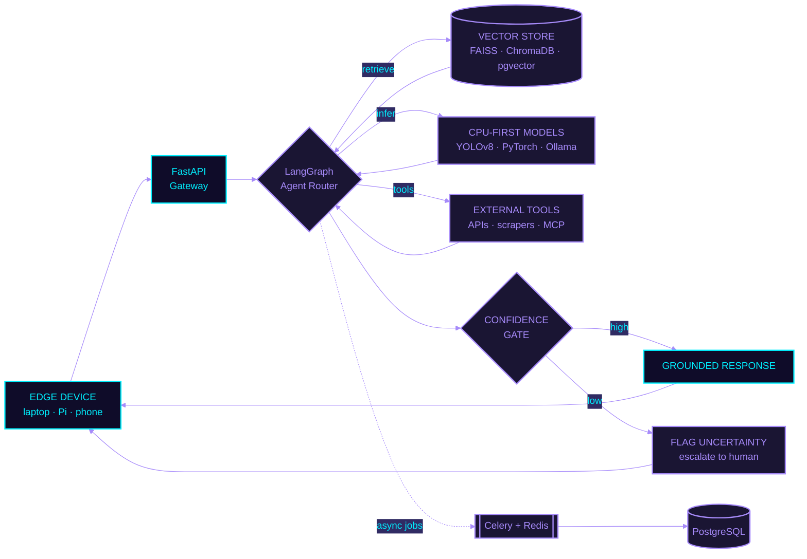

<a name="top"></a>


<div align="center">

[](https://johnsoncv.netlify.app/)

**`▸ NAVIGATE`**

[](#access)
[](#skills)
[](#arch)
[](#systems)
[](#hire)
[](#uplink)

</div>

<br/>

## `◤ 01 ◢` BOOT.SEQUENCE

```console
$ ./initialize --operator johnson_christopher_hassan

[ OK ] mounting identity ......................... johnson_christopher_hassan
[ OK ] class .................................... Full-Stack Software & AI Engineer
[ OK ] role ..................................... Software & AI Engineer @ BLECA SmartLabs
[ OK ] role ..................................... Software & AI Engineering Intern @ Neurotech Africa
[ OK ] education ................................ Computer Engineering @ MUST, Tanzania
[ OK ] location ................................. Mbeya, Tanzania [-8.9094, 33.4608]
[ OK ] stack .................................... Next.js + TypeScript :: FastAPI + Python :: PyTorch
[ OK ] loading mission .......................... software_should_work_where_its_needed_most()
[ OK ] specialism ............................... intelligent_systems_under_hardware_constraints()
[ OK ] runtime .................................. CPU-first :: offline-first :: edge-native
[ OK ] availability ............................. full_time_roles :: client_projects :: open_source

> system online. awaiting instructions_
```

<br/>

## `◤ 02 ◢` HOLO.ID

<div align="center">

<table>
<tr>
<td width="45%" align="center">


`OPERATOR // 96×96 RENDER`

</td>
<td width="55%" align="left">

```yaml
operator:   Johnson Christopher Hassan
callsign:   johnson2006christopher
class:      Full-Stack Software & AI Engineer
subclass:   Web Platforms / Agentic Systems / Edge AI
base:       Mbeya, Tanzania [UTC+3]
org:        BLECA SmartLabs
            Neurotech Africa
builds:     - Next.js / React / TypeScript front ends
            - FastAPI / async Python back ends
            - agentic + grounded RAG pipelines
            - CPU-first, offline-first vision engines
passion:    intelligent systems that run under
            severe hardware constraints
status:     ONLINE // roles, freelance, open source
```

<div align="center">

[](https://johnsoncv.netlify.app/)
[](https://johnsonchristopher.substack.com/)
[](https://www.linkedin.com/in/johnson-hassan-935124311/)
[](mailto:johnson2006christopher@gmail.com)

</div>

</td>
</tr>
</table>


</div>

<br/>

<a name="access"></a>

## `◤ 03 ◢` ACCESS.TERMINAL

> **This README is interactive.** Pick the door that fits you — every panel below expands.

<details>
<summary><b>🎯 &nbsp;I'm a RECRUITER / HIRING MANAGER</b> &nbsp;<code>click to expand</code></summary>

<br/>

**The 30-second version:**

| | |
| :--- | :--- |
| **Title** | Full-Stack Software & AI Engineer |
| **Currently** | Software & AI Engineer — BLECA SmartLabs · AI Engineering Intern — Neurotech Africa |
| **Studying** | Computer Engineering, MUST — Mbeya, Tanzania |
| **Front end** | Next.js · React · TypeScript · Tailwind · Framer Motion · shadcn/ui · local-first PWAs |
| **Back end** | FastAPI · async Python · PostgreSQL · Redis · Celery · Docker |
| **Specialism** | Edge AI, CPU-first computer vision, agentic LLM pipelines — intelligent systems under severe hardware constraints |
| **Shipped** | [`adaptshot`](https://pypi.org/project/adaptshot/) on PyPI · Legal Guard AI · ExamGuard AI · AgroScan+ |
| **Recognition** | 🥇 Gold Prize, SMART 2026 (South Korea) · 🏆 Best Project, Projekt Inspire 2023 |
| **Timezone** | UTC+3 (EAT) — overlaps a full working day with EU, half with US East |
| **Status** | Open to **full-time engineering roles**, **remote freelance / client projects**, and **open-source collaboration** |

**Fastest path:** [portfolio](https://johnsoncv.netlify.app/) → [AdaptShot repo](https://github.com/johnson2006christopher/adaptshot) → [email me](mailto:johnson2006christopher@gmail.com)

</details>

<details>
<summary><b>⚙️ &nbsp;I'm an ENGINEER — show me the technical decisions</b> &nbsp;<code>click to expand</code></summary>

<br/>

Four opinions that shape everything I build:

**1. CPU-first is a feature, not a compromise.**
A model that needs an A100 cannot run in a Tanzanian classroom, clinic, or farm. AdaptShot does few-shot vision under **250MB RAM** with no GPU — that constraint is the product requirement, not a limitation to apologise for.

**2. Uncertainty must be a first-class output.**
Every pipeline I ship has a confidence gate. A system that answers *"I don't know — escalate to a human"* is worth more in a high-stakes setting than one that guesses confidently and is wrong. See [`05 SYSTEM.ARCHITECTURE`](#arch).

**3. Offline-first changes your whole architecture.**
Local inference, local vector store, queued sync when connectivity returns. ExamGuard AI runs YOLOv8 on-device and cuts bandwidth by **98%** (< 15MB/hr) — that only works if the network is treated as optional from day one.

**4. The front end is part of the system, not a skin over it.**
I build the whole thing: Next.js + TypeScript + Tailwind on top, FastAPI and PostgreSQL underneath, one person owning the contract between them. Where the connection is unreliable that means a **local-first PWA** — IndexedDB-backed state, optimistic UI, a queued sync that reconciles when the network returns — so the interface never freezes waiting on a request that may never land. Motion (Framer Motion) and component discipline (shadcn/ui) are how a constrained app still feels finished.

**Read the code:** [AdaptShot](https://github.com/johnson2006christopher/adaptshot) · [Legal Guard AI](https://github.com/johnson2006christopher/legal_guard_ai)

</details>

<details>
<summary><b>💼 &nbsp;I want to HIRE or COMMISSION something</b> &nbsp;<code>click to expand</code></summary>

<br/>

I'm an independent engineer taking on a small number of client builds. Full service list in [`08 AVAILABILITY`](#hire).

**How an engagement runs:**

```console
$ ./engage --client you

[ 1 ] scope call ......... 30 min, free — what breaks today, what "done" means
[ 2 ] written proposal ... fixed scope, fixed price, milestones, no surprises
[ 3 ] build .............. weekly demo, working software each milestone
[ 4 ] handover ........... source, docs, deploy runbook, 2 weeks support
```

**Best fit:** full-stack AI web apps · private document RAG · agentic workflows · backend latency rescue · CPU-first / edge deployments · modern frontend engineering.

[](https://github.com/johnson2006christopher/johnson2006christopher/issues/new?title=%5BCOLLAB%5D%20Project%20proposal&body=**What%20you%27re%20building%3A**%0A%0A**Current%20stack%3A**%0A%0A**Timeline%3A**%0A%0A**What%20you%20need%20from%20me%3A**%0A)
[](mailto:johnson2006christopher@gmail.com)

</details>

<details>
<summary><b>🎓 &nbsp;I'm a STUDENT / just starting out</b> &nbsp;<code>click to expand</code></summary>

<br/>

I've mentored **1,000+ students** and helped set up labs in **10+ schools**. The advice I actually give:

- **Build the boring middle.** Everyone can call an API. Almost nobody can make it fast, observable, and correct when the network dies. That gap is your career.
- **Pick constraints on purpose.** "Make it work on a Raspberry Pi" teaches you more in a month than "make it work on a cloud GPU" does in a year.
- **Ship something small in public.** One published package beats ten private tutorials. [`pip install adaptshot`](https://pypi.org/project/adaptshot/) started exactly that way.
- **Learn to read, not just write.** The fastest engineers I know spend most of their time reading code they didn't write.

Where to start on this page → [`04 SKILL.MATRIX`](#skills) is roughly the order I'd learn things in, bottom row up.

[](https://github.com/johnson2006christopher/johnson2006christopher/issues/new?title=%5BASK%5D%20Question%20about%20...&body=**My%20question%3A**%0A%0A**Where%20I%27m%20stuck%3A**%0A)

</details>

<br/>

<a name="skills"></a>

## `◤ 04 ◢` SKILL.MATRIX

<div align="center">



</div>

> **75 technologies across 9 domains.** Tower height above = tools per domain. Expand any block for the full list.

<details open>
<summary><b>◈ &nbsp;CORE LANGUAGES</b> &nbsp;<code>7</code></summary>

<br/>


</details>

<details open>
<summary><b>◈ &nbsp;AI · MACHINE LEARNING · VISION</b> &nbsp;<code>10</code></summary>

<br/>


</details>

<details open>
<summary><b>◈ &nbsp;LLM · AGENTIC SYSTEMS</b> &nbsp;<code>11</code></summary>

<br/>


</details>

<details>
<summary><b>◈ &nbsp;VECTOR · RETRIEVAL</b> &nbsp;<code>3</code></summary>

<br/>


</details>

<details>
<summary><b>◈ &nbsp;BACKEND · DISTRIBUTED SYSTEMS</b> &nbsp;<code>6</code></summary>

<br/>


</details>

<details>
<summary><b>◈ &nbsp;DATA LAYER</b> &nbsp;<code>7</code></summary>

<br/>


</details>

<details>
<summary><b>◈ &nbsp;FRONTEND · FULL-STACK WEB</b> &nbsp;<code>9</code></summary>

<br/>


</details>

<details>
<summary><b>◈ &nbsp;DEVOPS · CLOUD · EDGE</b> &nbsp;<code>12</code></summary>

<br/>


</details>

<details>
<summary><b>◈ &nbsp;FOUNDATIONS</b> &nbsp;<code>10</code></summary>

<br/>


</details>

<div align="right"><a href="#top">↑ back to top</a></div>

<br/>

<a name="arch"></a>

## `◤ 05 ◢` SYSTEM.ARCHITECTURE

> The same five layers show up in almost everything I build. Rendered in 3D, then traced request-by-request.

<div align="center">



</div>

<details>
<summary><b>▶ &nbsp;TRACE A SINGLE REQUEST</b> &nbsp;<code>expand the live flow diagram</code></summary>

<br/>



</details>

<details>
<summary><b>▶ &nbsp;WHY THE CONFIDENCE GATE MATTERS</b> &nbsp;<code>the one design decision I argue about</code></summary>

<br/>

Most pipelines end at *"return the model's answer."* Mine end at *"return the answer **or** admit we don't have one."*

```console
$ trace --request "is this maize leaf diseased?"

  [ 0.94 ] confidence ...... ABOVE THRESHOLD  →  return diagnosis + evidence
  [ 0.38 ] confidence ...... BELOW THRESHOLD  →  return "uncertain", escalate to agronomist
```

In a rural clinic, classroom, or farm there is no second opinion one click away. A wrong-but-confident answer costs a harvest or a diagnosis. An honest *"I don't know"* costs a phone call. That trade is not close.

</details>

<div align="right"><a href="#top">↑ back to top</a></div>

<br/>

<a name="systems"></a>

## `◤ 06 ◢` DEPLOYED.SYSTEMS

### `[ LIVE ]` 🌿 [AdaptShot](https://github.com/johnson2006christopher/adaptshot)

**`CPU-FIRST FEW-SHOT COMPUTER VISION ENGINE`**

[](https://pypi.org/project/adaptshot/)
[](https://pypi.org/project/adaptshot/)
[](https://github.com/johnson2006christopher/adaptshot)

Offline, GPU-free few-shot vision built for edge deployment — laptops, Raspberry Pi, anywhere the cloud isn't. Runs under **250MB RAM**, adapts from fewer than 50 human corrections per class, and flags uncertainty instead of guessing wrong.

```bash
> pip install adaptshot
```

<details>
<summary><b>▶ &nbsp;WHAT PROBLEM IT SOLVES</b></summary>

<br/>

| | Conventional vision pipeline | AdaptShot |
| :--- | :--- | :--- |
| **Hardware** | GPU, often cloud-hosted | CPU only — laptop or Raspberry Pi |
| **Data needed** | Thousands of labelled images | Under 50 corrections per class |
| **Connectivity** | Round-trip to an API | Fully offline |
| **Memory** | Multiple GB | Under 250MB RAM |
| **Wrong answers** | Returned with high confidence | Flagged as uncertain |

Every one of those rows is the same bet: the deployment site has no GPU, no dataset, and no reliable internet — so the engine has to.

[](https://github.com/johnson2006christopher/adaptshot)
[](https://pypi.org/project/adaptshot/)

</details>

<br/>

### `[ LIVE ]` 🛡️ [Legal Guard AI — Tanzania Edition](https://github.com/johnson2006christopher/legal_guard_ai)

**`EMPATHETIC AI LEGAL ADVISOR // BROWSER EXTENSION`**

Side-panel assistant that decodes Tanzanian contracts, ToS documents, and statutes into plain, Swahili-friendly English.

<details>
<summary><b>▶ &nbsp;HOW IT'S BUILT</b></summary>

<br/>

Dual-engine design:

- **Contract Auditor** — 0–100 risk scoring with red-flag detection over uploaded documents.
- **Conversational Assistant** — covers BRELA, TRA, OSHA, and COSOTA procedures.

Both are grounded through a lightweight RAG pipeline (**ChromaDB + FastAPI**) over the Companies Act and Labour Act, so answers cite statute rather than improvising — keeping hallucination near zero on a domain where a confident invention could cost someone their business.

[](https://github.com/johnson2006christopher/legal_guard_ai)

</details>

<div align="right"><a href="#top">↑ back to top</a></div>

<br/>

## `◤ 07 ◢` CLASSIFIED.SYSTEMS

<div align="center">

| STATUS | PROJECT | ROLE | ARCHITECTURE |
| :---: | :---: | :---: | :--- |
| `🔒 PRIVATE` | **ExamGuard AI** | Creator & Lead Engineer | Edge-powered exam proctoring — local YOLOv8 inference cuts bandwidth 98% (< 15MB/hr) |
| `🔒 PRIVATE` | **Mail Room** | Backend Architect | Async email broadcasting engine — FastAPI · Celery · Redis |
| `🔒 PRIVATE` | **AgroScan+** | ML Engineer | Maize leaf disease detection, > 90% validation accuracy — PyTorch · TensorFlow · FastAPI |

</div>

<br/>

<a name="hire"></a>

## `◤ 08 ◢` AVAILABILITY // WHAT I BUILD FOR CLIENTS

<div align="center">


</div>

> I work as an **independent engineer** — hired directly, no agency in between. Five things I deliver end to end:

<div align="center">

| SERVICE | WHAT YOU GET | STACK |
| :--- | :--- | :--- |
| 🧩 **Full-Stack AI Web Applications** | A complete product — interface, API, model, deploy — shipped by one engineer | Next.js · FastAPI · LLMs / vision |
| 📄 **Private Document RAG & Agentic Workflows** | Your documents, searchable and grounded, without shipping them to a third party | LangGraph · pgvector · ChromaDB |
| ⚡ **High-Performance Async Backends & Latency Audits** | A profiled, measured before/after — slow endpoints found and fixed, not guessed at | FastAPI · Celery · Redis |
| 🔌 **CPU-First / Edge AI Deployment** | Vision and inference that runs offline on the hardware you already own | Offline vision models · lightweight engines |
| 📊 **Interactive Dashboards & Modern Frontend Engineering** | Fast, animated, accessible interfaces that hold up on a bad connection | React · TypeScript · Tailwind · Framer Motion |

[](https://github.com/johnson2006christopher/johnson2006christopher/issues/new?title=%5BCOLLAB%5D%20Project%20proposal&body=**What%20you%27re%20building%3A**%0A%0A**Current%20stack%3A**%0A%0A**Timeline%3A**%0A%0A**What%20you%20need%20from%20me%3A**%0A)
[](mailto:johnson2006christopher@gmail.com)

</div>

<div align="right"><a href="#top">↑ back to top</a></div>

<br/>

## `◤ 09 ◢` TELEMETRY

<div align="center">


</div>

<br/>

## `◤ 10 ◢` IMPACT.LOG

<div align="center">




</div>

<br/>

## `◤ 11 ◢` TRANSMISSIONS

Notes on backend optimization, AI deployment, and edge-system design.

<div align="center">

[](https://johnsonchristopher.substack.com/)

</div>

<br/>

<a name="uplink"></a>

## `◤ 12 ◢` UPLINK

<div align="center">

**`// THREE WAYS TO REACH ME — ALL OF THESE ARE CLICKABLE`**

[](https://github.com/johnson2006christopher/johnson2006christopher/issues/new?title=%5BSIGNAL%5D%20Saying%20hi&body=**Where%20I%20found%20you%3A**%0A%0A**What%20I%27m%20building%3A**%0A%0A**Why%20I%27m%20reaching%20out%3A**%0A)
[](https://github.com/johnson2006christopher/johnson2006christopher/issues/new?title=%5BCOLLAB%5D%20Project%20proposal&body=**What%20you%27re%20building%3A**%0A%0A**Current%20stack%3A**%0A%0A**Timeline%3A**%0A%0A**What%20you%20need%20from%20me%3A**%0A)
[](https://github.com/johnson2006christopher/adaptshot/issues/new?title=%5BBUG%5D%20&body=**What%20happened%3A**%0A%0A**Expected%3A**%0A%0A**Python%20version%20%2F%20OS%3A**%0A%0A**Minimal%20repro%3A**%0A)

</div>

<details>
<summary><b>❓ &nbsp;FREQUENTLY ASKED</b> &nbsp;<code>click to expand</code></summary>

<br/>

**What do you actually build?**

Systems that run AI where the infrastructure is thin — CPU-only vision, offline inference, agent pipelines that survive a dropped connection, and the async backends underneath them.

**Why CPU-first? Isn't that slower?**

Yes, and it's still the right call. A GPU-dependent model that can't be deployed is 0% useful at any speed. Constraining to CPU forces smaller models, better preprocessing, and honest latency budgets.

**Are you available for work?**

Yes — full-time engineering roles, remote freelance / client projects, and open-source collaboration. Fastest route is the 📨 button above or [email](mailto:johnson2006christopher@gmail.com).

**Are you a frontend engineer or an AI engineer?**

Both, deliberately. I ship the interface *and* the engine behind it — Next.js, React, TypeScript and Tailwind on top; FastAPI, PostgreSQL and the model layer underneath. Edge AI and CPU-first vision are what I go deep on for fun; full-stack delivery is what I do every day.

**What timezone do you work in?**

UTC+3 (East Africa Time) — a full overlap with European hours, partial with US East.

**What's your default stack for a new project?**

FastAPI + PostgreSQL + Redis on the backend, Next.js on the front, PyTorch or YOLOv8 for vision, LangGraph when the flow needs to be a state machine rather than a chain. Docker for everything.

**Can I use your code?**

The public repos are there to be read, forked, and shipped. If AdaptShot ends up in something you built, I'd genuinely like to hear about it — [open an issue](https://github.com/johnson2006christopher/johnson2006christopher/issues/new?title=%5BSIGNAL%5D%20I%20used%20your%20code&body=**What%20you%20built%3A**%0A%0A**Which%20project%20you%20used%3A**%0A).

</details>

<details>
<summary><b>⚠️ &nbsp;RESTRICTED — AUTHORISED PERSONNEL ONLY</b> &nbsp;<code>do not open</code></summary>

<br/>

```console
$ sudo ./unlock --level 5
[ WARN ] you were told not to open this

        █   █  ███  █   █       █████  ███  █   █ █   █ ████        █   █ █████
         █ █  █   █ █   █       █     █   █ █   █ ██  █ █   █       ██ ██ █    
          █   █   █ █   █       ████  █   █ █   █ █ █ █ █   █       █ █ █ ████ 
          █   █   █ █   █       █     █   █ █   █ █  ██ █   █       █   █ █    
          █    ███   ███        █      ███   ███  █   █ ████        █   █ █████

[ OK ] achievement unlocked: read_the_whole_readme
[ OK ] most people stop at the badges. you didn't.

> if you got this far, you should probably just email me.
```

[](mailto:johnson2006christopher@gmail.com?subject=I%20found%20the%20easter%20egg)

</details>

<br/>

<div align="center">

`▰▰▰▰▰▰▰▰▰▰▰▰▰▰▰▰▰▰▰▰▰▰▰▰▰▰▰▰▰▰▰▰▰▰▰▰▰▰▰▰▰▰▰▰▰▰`

```console
$ ./status --operator johnson

> connection_established
> ready_for_next_build_
```

[](https://johnsoncv.netlify.app/)
[](mailto:johnson2006christopher@gmail.com)

**Built with precision in Mbeya, Tanzania 🇹🇿**

<a href="#top">↑ back to top</a>

</div>


